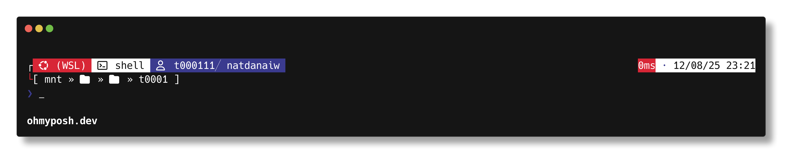

# Thailand Flag Oh My Posh Theme

This project provides a custom prompt theme for [Oh My Posh](https://ohmyposh.dev/) inspired by the colors and style of the Thailand national flag.

## Features
- Unique color scheme based on the Thailand flag
- Designed for use with Oh My Posh on any supported shell

## Installation
1. Download or clone this repository.
2. Copy the `thflag-omp.json` file to your preferred location.
3. Configure Oh My Posh to use this theme:
   - Edit your shell profile (e.g., `.bashrc`, `.zshrc`, `PowerShell $PROFILE`)
   - Set the theme path:
     ```sh
     oh-my-posh init pwsh --config <path-to>/thflag-omp.json | Invoke-Expression
     ```
     Replace `<path-to>` with the actual path to the `thflag-omp.json` file.

## Preview


## Reference
This theme is inspired by the "hul10" theme, which is included out of the box with Oh My Posh.

## License
MIT
